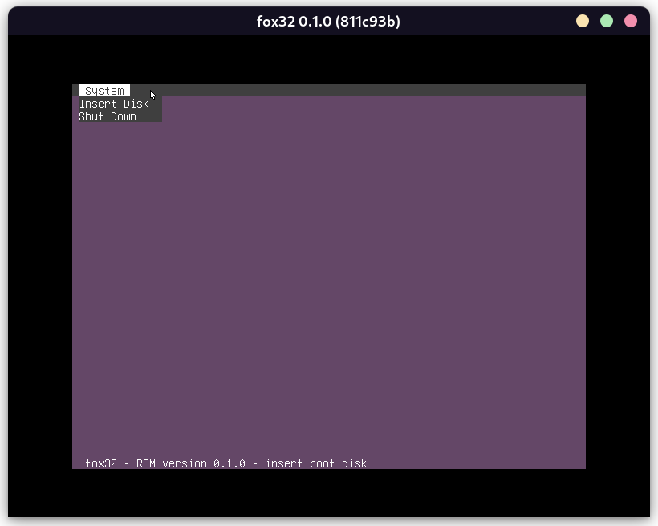

# fox32

**fox32** (stylized in all lowercase) is a 32 bit fantasy computer architecture, with a custom operating system and user interface inspired by various classic computers.

## Getting Started

**Note: This software is still very much in an early stage, and is currently more focused towards developers rather than end-users.**

Stable releases are available on the [Releases page](https://github.com/fox32-arch/fox32/releases).

Prebuilt binaries of the latest commit are also available on the [GitHub Actions page](https://github.com/fox32-arch/fox32/actions).

### Building

Download the latest release of [**fox32rom**](https://github.com/fox32-arch/fox32rom/releases). Create a folder in the root of this repo called `fox32.rom`, and place the downloaded `fox32.rom` file into that directory. Then simply run `cargo build --release`. The resulting binary will be saved as `target/release/fox32`. You can also run `cargo run --release` if you want to run it directly.

### Usage

Passing files as arguments will mount those files as disks, in the order that the arguments were passed. The most common use case is passing the [**fox32os**](https://github.com/fox32-arch/fox32os) disk image as the first argument: `fox32 fox32os.img`

See [encoding.md](docs/encoding.md) for information about the instruction set.

## License
This project is licensed under the [MIT license](LICENSE).
